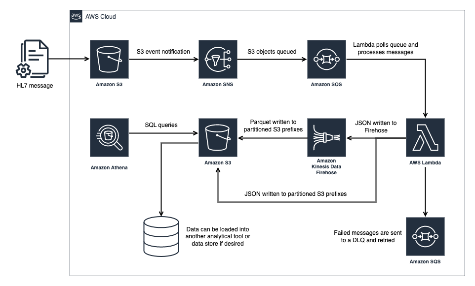

# hl7-data-lake

Building an HL7 data lake on AWS as described [here](https://www.michaelsambol.com/blogs/building_an_hl7_date_lake.html).

## Architecture



## Deploy 

Install dependencies:
```
npm install
```

You need Docker installed and running to package and deploy the Lambda function.

Create a Lambda layer with the [HL7 Python package](https://pypi.org/project/hl7/) and drop the ARN in `cdk.context.json`. The zip is included in this repo.
```
aws lambda publish-layer-version --layer-name hl7 --zip-file fileb://layers/hl7.zip --compatible-runtimes python3.9 --description "Parsing messages of Health Level 7 (HL7) version 2.x into Python objects"
```

Deploy stack:
```
// dev
cdk deploy --context environment=dev Hl7DataLakeStack-dev

// add additional environments if desired
```

## Test

`lambdas/test_hl7_parser.py` is a simple way to test the Lambda function locally without saving any PHI to disk (assumes you have AWS creds set up). 
Place the sample HL7 file in S3 and replace the bucket name in `test/event_1.json` (search for `CHANGE_ME`). Then run:

```
export STREAM_NAME=hl7-data-lake-dev
aws s3 cp test/sample_adt.hl7 s3://<BUCKET>/test/sample_adt.hl7
cd lambdas/
python test_hl7_parser.py
```

You can also drop files in the S3 bucket created by the CDK within the `raw/` prefix, which triggers the process in AWS:

```
aws s3 cp test/sample_adt.hl7 s3://<BUCKET>/raw/sample_adt.hl7
```
